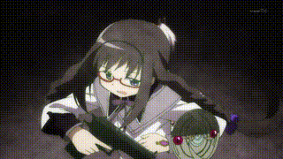
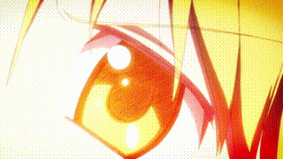

# 直接干预 9

你紧锁眉头审视着那张便条。究竟是阅读它更好，还是直接置之不理呢？你几乎可以确定这是织莉子留下的——除了那些精致书法的痕迹外，它看起来无瑕疵。你再次扫视了一下其他两位，确认她们没有注意到——焰此刻正在指着远方——然后你俯身捡起了便条。

便条很短，上面以流畅而完美的平假名书写着，这是那种练习了半生书法的人才能拥有的笔迹。上面简洁地写着：“这是必要的，而且仍然是。”

你轻轻地拉了拉便条的一角，它仿佛被什么东西卡住了一样。

但已经太晚了，你才发现那角落粘着的细线。

更晚了，你才看到那张便条下面的那个小黑盒子。

即便你的反应速度已经加快，但当那个盒子爆炸时，你还是在惊慌中跳开，只见火焰和碎片四散飞溅。剧烈的痛楚沿着你的脊柱直冲而上，金属碎片狠狠地撕裂着你的右腿和臀部。你意识到，这个地雷不可能是军用的——那些的*致命*范围可达数十米。

你面朝下重重地摔在屋顶的通风口边，成了一个满是血迹的身影。你在跳跃中伸展的右腿，承受了爆炸的直接冲击，现在只剩下血肉横飞的残缺，皮肉从骨骼上悬垂。

幸好你并不真的需要那些正围绕你的腿部流淌的血液。

你紧咬牙关，牙齿相互磨擦，发出刺耳的声音。

精神超越物质。

痛苦是可选择的。

你*不需要*感受痛苦。

你几乎可以感觉到大脑内部的某个东西*咔嚓* 一声，痛苦消退成了隐隐的痛楚。

“萨布丽娜！”麻美立刻来到你身边，眼睛睁得大大的，充满了惊慌。焰紧随其后。

---

- [ ] 自行填写

---

​

记住，直到现在，我对织莉子的行动只干预过*一次*。
