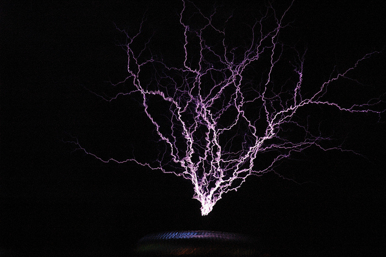

# “敌人出现” 10

“紫发的星子？” 你歪着头问那个在束缚中颤抖的少女。

“**没错！**” 银蓝色头发的地震能力者咬着牙怒视着你。

你耸了耸肩。星子在束缚中恳求地盯着你，不停颤抖。你做了个鬼脸，随意挥了挥手，镣铐就消失了，她跌落在地，蜷缩着身子，紧紧地抱着自己。

“...谢谢，”银绿色头发的说，她的语气中透着惊讶和如释重负。银蓝色头发的地震能力者——她们之间有某种家族相似之处吗？——明显放松了下来，身上的一些紧张感消失了。

“尽管发生了这些事，但我**确实**是来谈谈的，”你平静地说。又一次随意地挥了挥手，就把你自己、麻美和纪里香灵魂宝石上的悲伤擦去了，同样随意地展示了你的力量，松散的悲伤升腾到空中，加入到已经遮蔽太阳的弥漫云层中。透过来的光线给整个场景蒙上了一层诡异的、斑驳的紫色。

这种展示也没有被忽视。你用普通和非凡的感官观察她们的反应，以及她们的腐蚀程度。银绿色头发的女孩先看了看你，然后看了看闪电小姐。她们的目光掠过那些仍在悲伤的星云中如遥远恒星般环绕的悲叹之种，然后再次锁定彼此。掌管泥土的小姐瞪大了眼睛，她的目光在离开灵魂宝石的悲伤和懒洋洋地漂浮在空中的悲伤之间来回移动。

克隆女孩似乎没有太在意你；她的注意力仍然集中在纪里香身上。这个黑发女孩稍稍退了一点，但仍然摆出随时准备跳起的姿势，肌肉紧绷，随时准备行动。

紫发女孩从蜷缩的姿势中抬起头来，看到你宝石上最后一丝悲伤消失，脸上露出困惑的表情，然后，她的大脑也完全明白了这一点，也震惊地盯着你。

麻美只是温暖地微笑着，而纪里香则选择警惕地看着克隆女孩。

“好了，”你说，双臂交叉在身后。现在你已经**非常**鲜明地展示了你能做什么...“我其实愿意让你们**所有人**都下来。只要你们不跑掉。当然，也要停止攻击我们。”

她们再次以闪电般的速度交换了困惑的眼神和心灵交流。

“那就太好了...?”银绿色头发的说。

“你**同意**听我们说吗？”你平静地回答。

“是的，”她回答。

“那好吧，”你简单地说，然后释放了她们的束缚。当你重新加入你撕下的悲伤碎片时，她们的悲叹之种就离开了轨道，静止地悬浮在主人面前。纪里香领会了暗示，后退到你身边，与麻美相对而立。

石卷的女孩们看起来既不舒服，又困惑，还有些隐隐的不安。银绿色头发的犹豫地伸出手，似乎它会咬人一样，摘下一颗悬浮在她面前空中的悲叹之种。你让它在轻轻的拉扯下落入她手中，她畏缩了一下，差点把它掉在地上。

“那么，”你说。“这位是巴麻美——” 悠纪脸上掠过一丝像是认出这个名字的神情，“——还有吴纪里香。我是萨布丽娜...就只是萨布丽娜。我们是从见泷原市来的。”你一边说，一边指着麻美和纪里香，麻美高贵地点点头，而纪里香则猛地摇头，就像在赶走一只烦人的苍蝇。

银绿色头发的慢慢点了点头，小心地把悲叹之种放进口袋。“嗯。这位是小泉秋-——”她朝穿着黄色、过于华丽的裙子的克隆女孩挥了挥手。疲惫的、带着黄褐色的眼睛，在沉重的皱眉下望着你。

“——佐藤公子——”她指了指发电的女孩，她穿着淡紫色、白色和粉红色的褶皱裙子，与她的闪电相似。粉红色的眼睛警惕地看着你。

“——塚田星子——”这个女孩穿着华丽的明亮紫色板甲，上面用较浅的银色金属镶嵌着精致的花纹。不合理的大护肩覆盖在她的肩膀上，沉重的板甲手套松松垮垮地垂在身体两侧，手指还微微颤抖着。

“——井上友奈——” 在这里，银绿色头发的犹豫了一下，朝着穿银色和**蓝色**服装的女孩挥了挥手。你注意到她们之间**肯定**有某种家族相似之处。她们的颧骨、眼睛周围的形状...甚至她们的服装也有...非常**相似**的图案，浅色的、类似外骨骼的盔甲覆盖在内层之上，她的是蓝色的。

“——我是井上悠纪。”她说完。

麻美高贵地点头。“很高兴见到你们，”她用威严的语气说。你点头表示同意。

“那么，”你说。“你们现在愿意听我们说了吗？”

她们脸上再次露出困惑的表情，银绿色头发的小姐——悠纪——开口了。“我想是的...?”

“很好。”你果断地点点头。“那么，很简单。我们是来**谈谈**的。不是为了仙台、石卷，甚至不是为了见泷原本身而战。我们希望结束双方的敌对行动。**双方**的敌对行动。”

你举起一根手指。“作为一个诚意的表示，我愿意为你们净化悲叹之种。正如我展示的，我完全有能力做到这一点。”

有些时候，你真希望天气能**配合**一下。适时地来一声惊雷或一阵风，让你的外套戏剧性地飘动，那就**太欢迎**了。你甚至没有可以反光而显得闪亮可怕的眼镜，该死。

悠纪皱眉。“你...**知道**我们为什么战斗吧？”

“不完全知道，”你歪着头说，向石卷组挑了挑眉。“我很想听听你们的说法。当然，我听过仙台的说法。”

悠纪瞥了一眼友奈，然后又看向你。“还有什么好说的？长子...啊...椿蝶子，来自大学组，问我们是否愿意帮忙制服仙台组。我们当然同意了，所以当浜崎-——”提到这个名字时她眼睛周围的线条绷紧了，“--来的时候，我们就伏击了她。”

“她声称她是来谈判休战的，”你说。

她翻了个白眼。“你相信吗？你**见过**她，不是吗？”

在你感官的边缘，你能感觉到另外两个魔法气息正在从屋顶移动过来。她们动作缓慢，谨慎，但无可争议地朝你这边走来。

---

- [ ] 问起那两个人
- [x] 追问明子的事
  - [x] 语气冷静而坚定
  - [x] 目标：澄清明子的意图，看看是否有谈判的余地
- [ ] 请麻美介入
- [ ] 其他

---

今天的随机小知识：在空气中的电放电往往呈现紫色和白色，带点粉红色，而不是黄色。例如特斯拉线圈的长距离放电，如图所示。不是我拍的。

