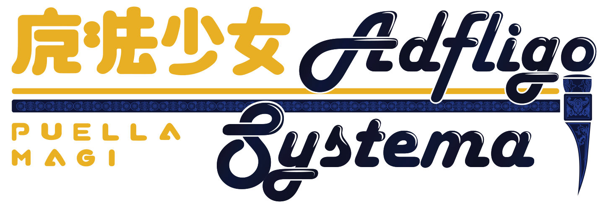
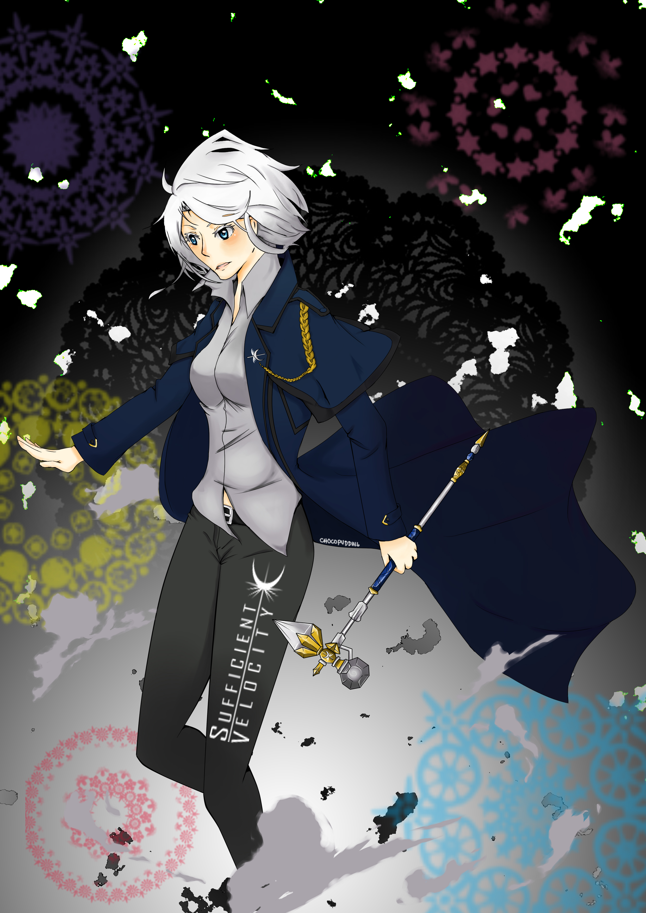

# 魔法少女小圆 打破系统

> 原作 [Puella Magi Adfligo Systema](https://forums.sufficientvelocity.com/threads/2538/)，作者 [Firnagzen](https://forums.sufficientvelocity.com/members/firnagzen.386/)
> 这是一个魔法少女小圆的同人小说，是继 [魔法少女小圆 飞向星空](https://tts.liuli.moe/) 之后吾辈最喜欢的魔法少女小圆同人，原作已经超过 800 章。讲述了一个女孩许下了控制**悲伤**的愿望，她会如何开始改变魔法少女们悲惨的命运呢？
> 这个翻译使用 GPT-4 初翻 + 人工校对，已经联系到原作者并取得许可，任何翻译问题请到 <https://github.com/liuli-moe/pmas/issues> 反馈或直接提 pr。

拯救世界还是拯救一个女孩——这真的有差别吗？你或许拥有难以想象的力量，但总有一些事情依旧艰难。

Logo 由 [defenestrator](https://forums.sufficientvelocity.com/members/defenestrator.889/) 设计。

## 分卷

- 卷一
  - Unforeseen Consequences - 不可预见的后果
  - Entanglement - 纠缠
  - Direct Intervention - 直接干预
  - Surface Tension - 表层张力
  - Undue Alarm - 不当的警觉
  - Apprehension - 忧虑
  - We've Got Hostiles - “敌人出现”
- 卷二
  - Under the Radar - 潜伏行动
  - Interloper - 不速之客
  - Our Benefactor - 我们的恩人
  - Residue Processing - 残渣处理
  - This mortal coil - 凡人心弦
  - Anomalous Materials - 异常物质
- On a Rail - 在轨道上
- A Red Letter Day - 好日子
- We Don't Go To Asunaro... - 我们不去翌桧市...
- Highway - 高速公路
- To the White Forest - 前往白色森林
- Point Insertion -
- Nova Prospekt - 诺瓦矿场
- Office Complex -
- Lowlife -
- Power Up -
- New -
- Hazard Course -

> 非常多的章节名都引用自游戏《半条命》，请参考现有翻译名。
